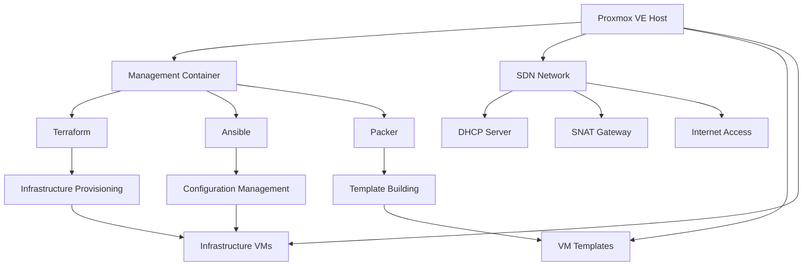
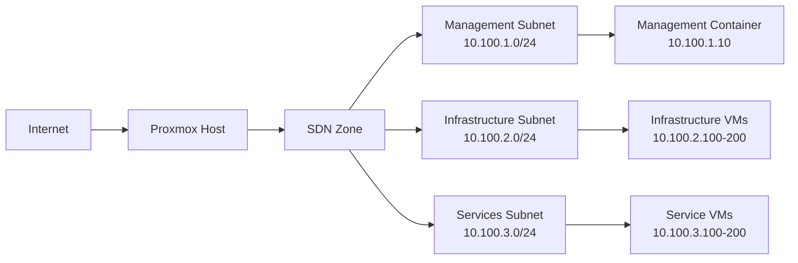
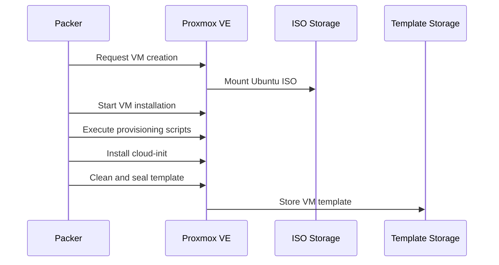
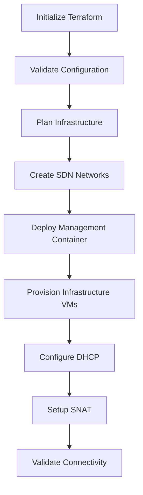
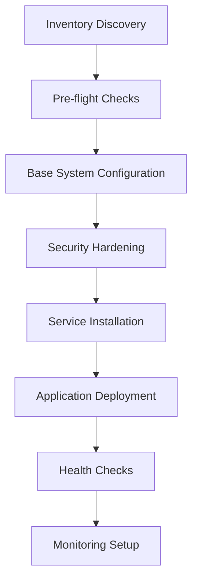
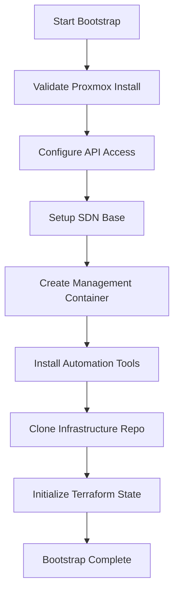

# Proxmox Infrastructure Automation Design

## Overview

This project implements a comprehensive infrastructure automation solution using Proxmox VE hypervisor. The system provides automated deployment and configuration of Linux-based infrastructure through a management container that orchestrates the entire environment using Ansible, Packer, and Terraform.

### Key Features
- Automated infrastructure provisioning from scratch
- Management container for centralized control
- SDN networking with SNAT and DHCP configuration
- Template-based VM deployment using Packer
- Infrastructure as Code with Terraform
- Configuration management with Ansible

## Architecture

### High-Level Architecture



### Component Architecture

| Component | Purpose | Technology |
|-----------|---------|------------|
| Management Container | Central orchestration and control | Docker/LXC |
| Proxmox API Client | Infrastructure provisioning | Terraform + Proxmox Provider |
| Template Builder | VM template creation | Packer |
| Configuration Engine | System configuration | Ansible |
| Network Controller | SDN management | Proxmox SDN |
| DHCP Service | IP address management | dnsmasq/ISC DHCP |

## Infrastructure Components

### 1. Management Container

**Container Specifications:**
- **Base Image**: Ubuntu 22.04 LTS
- **Resources**: 2 vCPU, 4GB RAM, 20GB Storage
- **Network**: Bridge to management network
- **Privileges**: Necessary API access to Proxmox

**Installed Tools:**
```yaml
tools:
  - terraform: "~> 1.5"
  - ansible: "~> 8.0"
  - packer: "~> 1.9"
  - python3: "3.10+"
  - proxmox-api: latest
  - git: latest
```

### 2. SDN Network Architecture

**Network Topology:**


**SDN Configuration:**
- **Zone Type**: Simple
- **VNET**: infrastructure-net
- **Subnets**:
  - Management: 10.100.1.0/24
  - Infrastructure: 10.100.2.0/24
  - Services: 10.100.3.0/24
- **SNAT**: Enabled for internet access
- **DHCP Ranges**:
  - Infrastructure: 10.100.2.100-10.100.2.200
  - Services: 10.100.3.100-10.100.3.200

### 3. Template Management

**Template Types:**
| Template | OS | Purpose | Tools Included |
|----------|----|---------| --------------|
| base-ubuntu-22 | Ubuntu 22.04 | Base template | cloud-init, qemu-guest-agent |
| docker-host | Ubuntu 22.04 | Container hosting | Docker, docker-compose |
| k8s-node | Ubuntu 22.04 | Kubernetes | kubelet, kubeadm, kubectl |
| web-server | Ubuntu 22.04 | Web services | nginx, certbot |

**Template Building Process:**


## Automation Workflows

### 1. Infrastructure Provisioning Flow

**Terraform Workflow:**


**Resource Creation Order:**
1. SDN Zone and VNETs
2. Subnet configuration
3. DHCP server setup
4. Management container deployment
5. Infrastructure VM provisioning
6. Network connectivity validation

### 2. Configuration Management Flow

**Ansible Workflow:**


## Network Configuration

### SDN Setup

**Zone Configuration:**
```yaml
sdn_zone:
  name: "infrastructure-zone"
  type: "simple"
  bridge: "vmbr1"
  mtu: 1500
```

**VNET Configuration:**
```yaml
vnets:
  - name: "management-net"
    zone: "infrastructure-zone"
    tag: 100
  - name: "infrastructure-net"
    zone: "infrastructure-zone"
    tag: 200
  - name: "services-net"
    zone: "infrastructure-zone"
    tag: 300
```

**Subnet Configuration:**
```yaml
subnets:
  - vnet: "management-net"
    subnet: "10.100.1.0/24"
    gateway: "10.100.1.1"
    snat: true
    dhcp-range:
      start: "10.100.1.100"
      end: "10.100.1.200"
  
  - vnet: "infrastructure-net"
    subnet: "10.100.2.0/24"
    gateway: "10.100.2.1"
    snat: true
    dhcp-range:
      start: "10.100.2.100"
      end: "10.100.2.200"
```

### DHCP Configuration

**DHCP Server Setup:**
- **Service**: dnsmasq
- **Lease Time**: 24 hours
- **DNS Servers**: 8.8.8.8, 1.1.1.1
- **Domain**: infra.local

**DHCP Reservations:**
```yaml
dhcp_reservations:
  - hostname: "mgmt-container"
    mac: "auto-generated"
    ip: "10.100.1.10"
  - hostname: "infra-gateway"
    mac: "auto-generated"
    ip: "10.100.2.10"
```

## Deployment Scripts

### 1. Bootstrap Script

**Purpose**: Initialize Proxmox host and create management infrastructure

**Script Flow:**


### 2. Infrastructure Deployment Script

**Purpose**: Deploy complete infrastructure using automation tools

**Deployment Phases:**
1. **Pre-deployment**: Validation and preparation
2. **Network Setup**: SDN and DHCP configuration
3. **Template Creation**: Build VM templates with Packer
4. **Infrastructure Provisioning**: Deploy VMs with Terraform
5. **Configuration**: Apply Ansible playbooks
6. **Validation**: Test connectivity and services

### 3. Destruction Script

**Purpose**: Clean teardown of infrastructure

**Teardown Order:**
1. Stop all services
2. Destroy VMs (Terraform)
3. Remove templates
4. Clean SDN configuration
5. Remove management container

## File Structure

```
proxmox-infrastructure/
├── bootstrap/
│   ├── install-proxmox.sh
│   ├── setup-sdn.sh
│   └── create-mgmt-container.sh
├── terraform/
│   ├── main.tf
│   ├── variables.tf
│   ├── outputs.tf
│   ├── modules/
│   │   ├── sdn/
│   │   ├── containers/
│   │   └── vms/
│   └── environments/
│       ├── dev/
│       └── prod/
├── ansible/
│   ├── inventory/
│   ├── playbooks/
│   ├── roles/
│   └── group_vars/
├── packer/
│   ├── ubuntu-22-base.pkr.hcl
│   ├── docker-host.pkr.hcl
│   └── scripts/
└── scripts/
    ├── deploy.sh
    ├── destroy.sh
    └── validate.sh
```

## Security Considerations

### Access Control
- **API Security**: Token-based authentication for Proxmox API
- **Container Security**: Minimal privileges for management container
- **Network Security**: Firewall rules for inter-subnet communication
- **SSH Access**: Key-based authentication only

### Network Security
- **Isolation**: VLANs for network segmentation
- **Firewall**: iptables rules for traffic control
- **SNAT Security**: Controlled outbound access
- **Monitoring**: Network traffic monitoring

## Testing Strategy

### Unit Testing
- Terraform configuration validation
- Ansible playbook syntax checking
- Packer template validation
- Script functionality testing

### Integration Testing
- End-to-end deployment testing
- Network connectivity validation
- Service health checks
- Performance benchmarking

### Validation Procedures
- Infrastructure state verification
- Security compliance checking
- Backup and recovery testing
- Disaster recovery procedures

## Monitoring and Maintenance

### Health Monitoring
- **Infrastructure Health**: VM status and resource usage
- **Network Health**: Connectivity and bandwidth monitoring
- **Service Health**: Application and service status
- **Security Monitoring**: Access logs and security events

### Maintenance Procedures
- **Template Updates**: Regular OS and security updates
- **Configuration Drift**: Automated configuration compliance
- **Backup Management**: Infrastructure state backups
- **Log Management**: Centralized logging and rotation