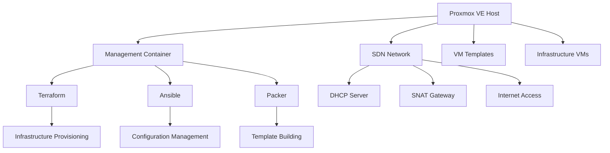

# Proxmox Infrastructure Automation

A comprehensive infrastructure automation solution for Proxmox VE using Terraform, Packer, and Ansible. This project provides automated deployment and configuration of Linux-based infrastructure through a management container that orchestrates the entire environment.

## 🚀 Features

- **Automated Infrastructure Provisioning**: Complete infrastructure deployment from scratch
- **Management Container**: Centralized control using LXC container with all automation tools
- **SDN Networking**: Software Defined Networking with SNAT and DHCP configuration
- **Template-Based Deployment**: VM templates built with Packer for consistent deployments
- **Infrastructure as Code**: Terraform modules for reproducible infrastructure
- **Configuration Management**: Ansible playbooks for system configuration and maintenance
- **Multi-Environment Support**: Separate configurations for development, staging, and production
- **Comprehensive Validation**: Automated testing and validation scripts

## 🏗️ Architecture

### High-Level Overview



### Network Architecture

- **Management Network**: `10.100.1.0/24` - Management container and tools
- **Infrastructure Network**: `10.100.2.0/24` - Core infrastructure VMs
- **Services Network**: `10.100.3.0/24` - Application and service VMs
- **Internet Access**: SNAT configuration for outbound connectivity
- **DHCP**: Automatic IP assignment with reserved ranges

## 📋 Prerequisites

### Proxmox VE Requirements

- Proxmox VE 8.0 or later
- Minimum 32GB RAM, 500GB storage
- Network connectivity and internet access
- API access enabled

### Local Development Requirements

- Linux/WSL environment (for running scripts)
- SSH client
- Git

## 🚀 Quick Start

### 1. Initial Setup

```bash
# Clone the repository
git clone <your-repo-url>
cd proxmox_attacks

# Make scripts executable
chmod +x bootstrap/*.sh scripts/*.sh
```

### 2. Configure Proxmox API Access

```bash
# Set environment variables
export PROXMOX_API_URL="https://your-proxmox-host:8006/api2/json"
export PROXMOX_API_TOKEN_ID="your-token-id"
export PROXMOX_API_TOKEN_SECRET="your-token-secret"
```

### 3. Bootstrap Proxmox

```bash
# Run on Proxmox host as root
./bootstrap/install-proxmox.sh
```

### 4. Deploy Infrastructure

```bash
# Deploy complete infrastructure
./scripts/deploy.sh

# Or deploy specific components
./scripts/deploy.sh --skip-bootstrap    # Skip bootstrap
./scripts/deploy.sh --skip-templates    # Skip template building
./scripts/deploy.sh --dry-run          # Preview deployment
```

### 5. Validate Deployment

```bash
# Run validation tests
./scripts/validate.sh

# Quick validation
./scripts/validate.sh --quick
```

## 📁 Project Structure

```
proxmox_attacks/
├── bootstrap/                  # Initial Proxmox setup scripts
│   └── install-proxmox.sh     # Main bootstrap script
├── terraform/                 # Infrastructure as Code
│   ├── main.tf               # Main Terraform configuration
│   ├── variables.tf          # Variable definitions
│   ├── outputs.tf            # Output definitions
│   ├── modules/              # Terraform modules
│   │   ├── sdn/              # SDN configuration
│   │   ├── containers/       # LXC container management
│   │   └── vms/              # VM management
│   └── environments/         # Environment-specific configs
│       ├── dev/
│       └── prod/
├── ansible/                  # Configuration management
│   ├── inventory/            # Inventory files
│   ├── playbooks/           # Ansible playbooks
│   ├── roles/               # Ansible roles
│   ├── group_vars/          # Group variables
│   ├── ansible.cfg          # Ansible configuration
│   └── site.yml            # Main site playbook
├── packer/                  # VM template building
│   ├── ubuntu-22-base.pkr.hcl    # Base Ubuntu template
│   ├── docker-host.pkr.hcl       # Docker host template
│   ├── http/                      # Autoinstall files
│   └── scripts/                   # Build scripts
├── scripts/                 # Management scripts
│   ├── deploy.sh           # Main deployment script
│   ├── destroy.sh          # Infrastructure destruction
│   └── validate.sh         # Validation and testing
└── docs/                   # Documentation
```

## 🔧 Configuration

### Environment Variables

| Variable | Description | Required |
|----------|-------------|----------|
| `PROXMOX_API_URL` | Proxmox API endpoint | Yes |
| `PROXMOX_API_TOKEN_ID` | API token ID | Yes |
| `PROXMOX_API_TOKEN_SECRET` | API token secret | Yes |

### Terraform Variables

Edit `terraform/environments/dev/terraform.tfvars` to customize your deployment:

```hcl
# Basic Configuration
environment = "dev"
project_name = "my-infrastructure"
target_node = "pve"

# Network Configuration
management_subnet = "10.100.1.0/24"
infrastructure_subnet = "10.100.2.0/24"

# VM Configuration
infrastructure_vm_configs = {
  "docker-host-01" = {
    vmid = 201
    name = "docker-host-01"
    memory = 4096
    cores = 2
    disk_size = "40G"
    network_ip = "10.100.2.101/24"
    tags = ["docker", "infrastructure"]
  }
}
```

## 🚀 Deployment Guide

### Step-by-Step Deployment

#### 1. Bootstrap Phase
```bash
# Initialize Proxmox with SDN and management container
./bootstrap/install-proxmox.sh
```

**What it does:**
- Configures SDN networking
- Creates management container
- Installs automation tools
- Sets up firewall rules

#### 2. Template Building
```bash
# Build VM templates (runs automatically in deploy.sh)
cd packer
packer build ubuntu-22-base.pkr.hcl
packer build docker-host.pkr.hcl
```

#### 3. Infrastructure Provisioning
```bash
# Deploy infrastructure with Terraform
cd terraform
terraform init
terraform plan -var-file="environments/dev/terraform.tfvars"
terraform apply
```

#### 4. Configuration Management
```bash
# Configure systems with Ansible
cd ansible
ansible-playbook site.yml
```

### Deployment Options

```bash
# Full deployment
./scripts/deploy.sh

# Environment-specific deployment
./scripts/deploy.sh --environment prod

# Partial deployment
./scripts/deploy.sh --skip-bootstrap --skip-templates

# Dry run (preview)
./scripts/deploy.sh --dry-run

# Sequential template building
./scripts/deploy.sh --sequential
```

## 🧪 Testing and Validation

### Validation Tests

The validation script tests:

- ✅ Proxmox API connectivity
- ✅ SDN configuration
- ✅ Management container
- ✅ VM templates
- ✅ Infrastructure VMs
- ✅ Network connectivity
- ✅ SSH access
- ✅ Docker infrastructure
- ✅ Ansible connectivity
- ✅ Security configuration
- ✅ System health

```bash
# Run all tests
./scripts/validate.sh

# Quick tests only
./scripts/validate.sh --quick

# Verbose output
./scripts/validate.sh --verbose
```

### Manual Testing

```bash
# Access management container
pct enter 100

# Test VM connectivity
ping 10.100.2.101  # Docker host
ping 10.100.2.111  # K8s master

# SSH to VMs
ssh ubuntu@10.100.2.101

# Check Terraform state
cd /opt/infrastructure/terraform
terraform show

# Check Ansible inventory
cd /opt/infrastructure/ansible
ansible-inventory --list
```

## 🗑️ Cleanup and Destruction

### Safe Infrastructure Destruction

```bash
# Destroy infrastructure (with confirmation)
./scripts/destroy.sh

# Force destruction (no confirmation)
./scripts/destroy.sh --force

# Keep VM templates
./scripts/destroy.sh --keep-templates

# Dry run destruction
./scripts/destroy.sh --dry-run
```

### Manual Cleanup

```bash
# Stop all VMs
qm stop 201 211 221

# Stop management container
pct stop 100

# Remove VMs
qm destroy 201 211 221

# Remove container
pct destroy 100

# Clean SDN configuration
pvesh delete /cluster/sdn/vnets/management-net
pvesh delete /cluster/sdn/vnets/infrastructure-net
pvesh delete /cluster/sdn/zones/infrastructure-zone
```

## 🔍 Monitoring and Maintenance

### System Monitoring

```bash
# Check system status
./scripts/validate.sh --quick

# Monitor container resources
pct list
qm list

# Check network status
pvesh get /cluster/sdn/status

# View logs
tail -f logs/deployment-*.log
tail -f logs/validation-*.log
```

### Maintenance Tasks

```bash
# Update VM templates
cd packer
packer build --force ubuntu-22-base.pkr.hcl

# Update infrastructure
cd terraform
terraform plan
terraform apply

# Update configuration
cd ansible
ansible-playbook site.yml --tags security
```

## 🛠️ Customization

### Adding New VMs

1. **Update Terraform variables:**
```hcl
infrastructure_vm_configs = {
  # ... existing VMs ...
  "web-server-01" = {
    vmid = 301
    name = "web-server-01"
    memory = 2048
    cores = 2
    disk_size = "30G"
    network_ip = "10.100.3.101/24"
    tags = ["web", "nginx"]
  }
}
```

2. **Update Ansible inventory:**
```ini
[web_servers]
web-server-01 ansible_host=10.100.3.101
```

3. **Create Ansible role:**
```bash
ansible-galaxy init ansible/roles/nginx_server
```

### Adding New Networks

1. **Update SDN configuration in bootstrap script**
2. **Add VNET and subnet definitions**
3. **Update Terraform variables**
4. **Update firewall rules**

### Custom Packer Templates

```bash
# Create new template
cp packer/ubuntu-22-base.pkr.hcl packer/my-custom-template.pkr.hcl

# Modify provisioning steps
# Add to deployment script
```

## 🔧 Troubleshooting

### Common Issues

#### Bootstrap Issues
```bash
# Check Proxmox version
pveversion

# Check API access
curl -k "$PROXMOX_API_URL/version"

# Check SDN status
pvesh get /cluster/sdn/status
```

#### Template Building Issues
```bash
# Check ISO download
pvesm list local | grep iso

# Check packer logs
packer build -debug template.pkr.hcl

# Check VM creation
qm list | grep 9999
```

#### Network Issues
```bash
# Check SDN configuration
pvesh get /cluster/sdn

# Check DHCP leases
cat /var/lib/dhcp/dhcpd.leases

# Test connectivity
ping 10.100.1.1  # Gateway
```

#### Terraform Issues
```bash
# Check provider version
terraform version

# Refresh state
terraform refresh

# Import existing resources
terraform import proxmox_vm_qemu.vm 201
```

#### Ansible Issues
```bash
# Check connectivity
ansible all -m ping

# Check SSH keys
ssh-add -l

# Run with verbose output
ansible-playbook -vvv site.yml
```

### Log Files

- **Deployment logs**: `logs/deployment-*.log`
- **Validation logs**: `logs/validation-*.log`
- **Packer logs**: `packer/packer-*.log`
- **Terraform logs**: `terraform/terraform.log`
- **Ansible logs**: `ansible/ansible.log`

## 📖 Advanced Usage

### Multi-Environment Management

```bash
# Deploy to different environments
./scripts/deploy.sh --environment dev
./scripts/deploy.sh --environment staging
./scripts/deploy.sh --environment prod
```

### CI/CD Integration

```yaml
# Example GitLab CI/CD pipeline
stages:
  - validate
  - deploy
  - test

validate:
  script:
    - ./scripts/deploy.sh --dry-run

deploy:
  script:
    - ./scripts/deploy.sh --environment staging
  only:
    - main

test:
  script:
    - ./scripts/validate.sh
  after_script:
    - ./scripts/destroy.sh --force
```

### Backup and Recovery

```bash
# Backup Terraform state
cp terraform/terraform.tfstate backups/

# Backup VM snapshots
qm snapshot 201 backup-$(date +%Y%m%d)

# Export container
pct stop 100
vzdump 100 --storage local --mode stop
```

## 🤝 Contributing

1. **Fork the repository**
2. **Create a feature branch**
3. **Make your changes**
4. **Test thoroughly**
5. **Submit a pull request**

### Development Guidelines

- Follow existing code style
- Add tests for new features
- Update documentation
- Use semantic versioning

## 📄 License

This project is licensed under the MIT License - see the LICENSE file for details.

## 🆘 Support

For support and questions:

1. **Check the troubleshooting guide**
2. **Review log files**
3. **Search existing issues**
4. **Create a new issue with:**
   - Environment details
   - Error messages
   - Log excerpts
   - Steps to reproduce

## 🎯 Roadmap

- [ ] Kubernetes cluster automation
- [ ] Monitoring stack (Prometheus/Grafana)
- [ ] Backup automation
- [ ] High availability configuration
- [ ] Multi-node Proxmox support
- [ ] Cloud provider integration
- [ ] Web dashboard
- [ ] API server

---

**Built with ❤️ for infrastructure automation**